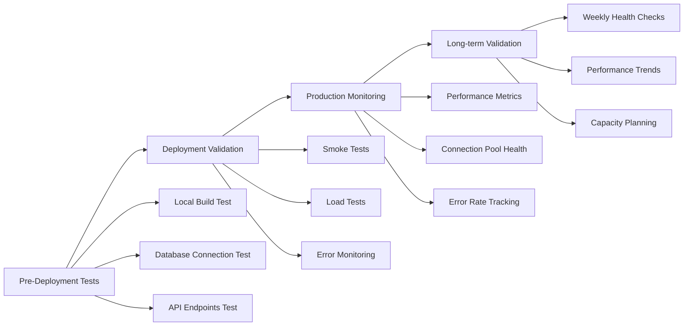

# 🧪 TESTING & VALIDATION PLAN
## Cascais Fishing Production Deployment Validation

---

## 🎯 **TESTING STRATEGY OVERVIEW**



---

## 🚀 **PHASE 1: PRE-DEPLOYMENT VALIDATION**

### **Step 1: Local Environment Testing**

```bash
# 1. Install new dependencies
npm install
npm run build

# 2. Verify Prisma Client generation
npx prisma generate

# 3. Test database connectivity
npm run dev
curl http://localhost:3000/api/profiles?limit=1
```

**Expected Output:**
```json
{
  "status": 200,
  "data": [...],
  "responseTime": "<500ms"
}
```

### **Step 2: Database Connection Validation**

```typescript
// Test script: scripts/test-db-connection.ts
import { prisma, getPrismaStats } from '@/lib/prisma'

async function testDatabaseConnection() {
  console.log('🧪 Testing database connection...')
  
  try {
    // Test 1: Basic connectivity
    const result = await prisma.$queryRaw`SELECT 1 as test`
    console.log('✅ Basic connectivity:', result)
    
    // Test 2: Complex query
    const profileCount = await prisma.fisherProfile.count()
    console.log('✅ Profile count:', profileCount)
    
    // Test 3: Health check
    const isHealthy = await prisma.$healthCheck()
    console.log('✅ Health check:', isHealthy)
    
    // Test 4: Connection stats
    const stats = getPrismaStats()
    console.log('✅ Connection stats:', stats)
    
    console.log('🎉 All database tests passed!')
    
  } catch (error) {
    console.error('❌ Database test failed:', error)
    process.exit(1)
  } finally {
    await prisma.$disconnect()
  }
}

testDatabaseConnection()
```

### **Step 3: API Endpoints Validation**

```bash
# Test all critical endpoints
curl -w "@curl-format.txt" -s -o /dev/null "http://localhost:3000/api/profiles?limit=5"
curl -w "@curl-format.txt" -s -o /dev/null "http://localhost:3000/api/health/database"
```

**Create curl-format.txt:**
```
     time_namelookup:  %{time_namelookup}\n
        time_connect:  %{time_connect}\n
     time_appconnect:  %{time_appconnect}\n
    time_pretransfer:  %{time_pretransfer}\n
       time_redirect:  %{time_redirect}\n
  time_starttransfer:  %{time_starttransfer}\n
                     ----------\n
          time_total:  %{time_total}\n
         http_status:  %{http_code}\n
```

---

## 🌐 **PHASE 2: DEPLOYMENT VALIDATION**

### **Step 1: Staging Deployment**

```bash
# Deploy to Vercel preview
vercel deploy

# Get preview URL and test
PREVIEW_URL=$(vercel --prod 2>&1 | grep -o 'https://[^ ]*')
echo "Testing preview: $PREVIEW_URL"

# Automated smoke tests
curl -f "$PREVIEW_URL/api/profiles?limit=1" || echo "❌ Profiles API failed"
curl -f "$PREVIEW_URL/api/health/database" || echo "❌ Health check failed"
```

### **Step 2: Production Smoke Tests**

```bash
# Production smoke test script
#!/bin/bash
set -e

PROD_URL="https://cascais-fishing.vercel.app"
ENDPOINTS=(
  "/api/profiles?limit=1"
  "/api/health/database"
  "/api/profiles?userId=test-user"
)

echo "🔥 Starting production smoke tests..."

for endpoint in "${ENDPOINTS[@]}"; do
  echo "Testing: $PROD_URL$endpoint"
  
  response=$(curl -s -w "\n%{http_code}" "$PROD_URL$endpoint")
  http_code=$(echo "$response" | tail -n1)
  body=$(echo "$response" | head -n -1)
  
  if [ "$http_code" -eq 200 ] || [ "$http_code" -eq 404 ]; then
    echo "✅ $endpoint: HTTP $http_code"
  else
    echo "❌ $endpoint: HTTP $http_code"
    echo "Response: $body"
    exit 1
  fi
done

echo "🎉 All smoke tests passed!"
```

### **Step 3: Load Testing**

```typescript
// Load test with concurrent connections
import { performance } from 'perf_hooks'

interface TestResult {
  url: string
  status: number
  duration: number
  success: boolean
  error?: string
}

class LoadTester {
  private baseUrl: string
  private results: TestResult[] = []

  constructor(baseUrl: string) {
    this.baseUrl = baseUrl
  }

  async testEndpoint(endpoint: string, concurrency: number = 10, total: number = 100): Promise<TestResult[]> {
    console.log(`🧪 Load testing ${endpoint} (${total} requests, ${concurrency} concurrent)`)
    
    const batches = Math.ceil(total / concurrency)
    const results: TestResult[] = []
    
    for (let batch = 0; batch < batches; batch++) {
      const batchSize = Math.min(concurrency, total - batch * concurrency)
      const promises = []
      
      for (let i = 0; i < batchSize; i++) {
        promises.push(this.singleRequest(`${this.baseUrl}${endpoint}`))
      }
      
      const batchResults = await Promise.all(promises)
      results.push(...batchResults)
      
      console.log(`   Batch ${batch + 1}/${batches} completed`)
    }
    
    this.results.push(...results)
    return results
  }

  private async singleRequest(url: string): Promise<TestResult> {
    const start = performance.now()
    
    try {
      const response = await fetch(url)
      const duration = performance.now() - start
      
      return {
        url,
        status: response.status,
        duration,
        success: response.ok,
      }
    } catch (error) {
      const duration = performance.now() - start
      
      return {
        url,
        status: 0,
        duration,
        success: false,
        error: error.message,
      }
    }
  }

  analyzeResults(): void {
    const successful = this.results.filter(r => r.success)
    const failed = this.results.filter(r => !r.success)
    
    if (successful.length === 0) {
      console.log('❌ No successful requests!')
      return
    }

    const durations = successful.map(r => r.duration)
    const avgDuration = durations.reduce((a, b) => a + b, 0) / durations.length
    const p95Duration = durations.sort()[Math.floor(durations.length * 0.95)]
    const maxDuration = Math.max(...durations)
    
    console.log('\n📊 Load Test Results:')
    console.log(`   Total Requests: ${this.results.length}`)
    console.log(`   Successful: ${successful.length} (${(successful.length / this.results.length * 100).toFixed(1)}%)`)
    console.log(`   Failed: ${failed.length}`)
    console.log(`   Average Response Time: ${avgDuration.toFixed(0)}ms`)
    console.log(`   95th Percentile: ${p95Duration.toFixed(0)}ms`)
    console.log(`   Max Response Time: ${maxDuration.toFixed(0)}ms`)
    
    // Performance thresholds
    if (avgDuration > 1000) {
      console.warn('⚠️  Average response time > 1s')
    }
    if (p95Duration > 2000) {
      console.warn('⚠️  95th percentile > 2s')
    }
    if (successful.length / this.results.length < 0.99) {
      console.warn('⚠️  Success rate < 99%')
    }
  }
}

// Run load tests
async function runLoadTests() {
  const tester = new LoadTester('https://cascais-fishing.vercel.app')
  
  // Test critical endpoints
  await tester.testEndpoint('/api/profiles?limit=5', 5, 50)
  await tester.testEndpoint('/api/health/database', 3, 20)
  
  tester.analyzeResults()
}

runLoadTests().catch(console.error)
```

---

## 📊 **PHASE 3: PRODUCTION MONITORING**

### **Real-time Health Dashboard**

```typescript
// app/api/admin/health/route.ts
import { NextResponse } from 'next/server'
import { prisma, getPrismaStats } from '@/lib/prisma'

export async function GET() {
  const healthChecks = await Promise.allSettled([
    // Database connectivity
    prisma.$queryRaw`SELECT 1`,
    
    // Profile system availability
    prisma.fisherProfile.count(),
    
    // Recent activity check
    prisma.fisherProfile.findFirst({
      where: { lastActiveAt: { gte: new Date(Date.now() - 24 * 60 * 60 * 1000) } }
    }),
    
    // Connection pool status
    Promise.resolve(getPrismaStats()),
  ])

  const [dbTest, profileCount, recentActivity, poolStats] = healthChecks

  const health = {
    timestamp: new Date().toISOString(),
    status: healthChecks.every(check => check.status === 'fulfilled') ? 'healthy' : 'degraded',
    
    database: {
      connected: dbTest.status === 'fulfilled',
      profileCount: profileCount.status === 'fulfilled' ? profileCount.value : 'unknown',
      recentActivity: recentActivity.status === 'fulfilled' && !!recentActivity.value,
    },
    
    connections: poolStats.status === 'fulfilled' ? poolStats.value : {},
    
    performance: {
      responseTime: Date.now() - parseInt(new URLSearchParams(new URL(request.url).search).get('start') || '0'),
    },
    
    errors: healthChecks
      .filter(check => check.status === 'rejected')
      .map(check => check.reason?.message),
  }

  const status = health.status === 'healthy' ? 200 : 503
  return NextResponse.json(health, { status })
}
```

### **Monitoring Alerts Setup**

```json
// monitoring/alerts.json
{
  "alerts": [
    {
      "name": "API Response Time",
      "condition": "avg_response_time > 1000ms",
      "severity": "warning",
      "actions": ["email", "slack"]
    },
    {
      "name": "Error Rate",
      "condition": "error_rate > 5%",
      "severity": "critical", 
      "actions": ["email", "sms", "slack"]
    },
    {
      "name": "Database Connections",
      "condition": "connection_count > 5",
      "severity": "warning",
      "actions": ["email"]
    },
    {
      "name": "WASM Error Detection",
      "condition": "error_message contains 'wasm'",
      "severity": "critical",
      "actions": ["email", "sms", "slack"]
    }
  ],
  
  "metrics": [
    "response_time_95p",
    "error_rate_5min", 
    "database_connection_count",
    "function_duration",
    "cold_start_frequency"
  ]
}
```

---

## 📈 **PHASE 4: PERFORMANCE BENCHMARKING**

### **Before/After Comparison**

```typescript
// Performance benchmark script
class PerformanceBenchmark {
  private metrics: Array<{
    timestamp: Date
    endpoint: string
    responseTime: number
    status: number
    errors?: string[]
  }> = []

  async benchmark(endpoints: string[], iterations: number = 20): Promise<void> {
    console.log('🏃‍♂️ Starting performance benchmark...')
    
    for (const endpoint of endpoints) {
      console.log(`Testing ${endpoint}...`)
      
      for (let i = 0; i < iterations; i++) {
        const start = Date.now()
        
        try {
          const response = await fetch(`https://cascais-fishing.vercel.app${endpoint}`)
          const responseTime = Date.now() - start
          
          this.metrics.push({
            timestamp: new Date(),
            endpoint,
            responseTime,
            status: response.status,
          })
          
          if (!response.ok) {
            const errorText = await response.text()
            this.metrics[this.metrics.length - 1].errors = [errorText]
          }
          
        } catch (error) {
          this.metrics.push({
            timestamp: new Date(),
            endpoint,
            responseTime: Date.now() - start,
            status: 0,
            errors: [error.message],
          })
        }
        
        // Small delay between requests
        await new Promise(resolve => setTimeout(resolve, 100))
      }
    }
    
    this.generateReport()
  }

  private generateReport(): void {
    const endpointStats = new Map<string, {
      count: number
      avgResponseTime: number
      minResponseTime: number
      maxResponseTime: number
      successRate: number
      errors: string[]
    }>()
    
    // Group by endpoint
    for (const metric of this.metrics) {
      if (!endpointStats.has(metric.endpoint)) {
        endpointStats.set(metric.endpoint, {
          count: 0,
          avgResponseTime: 0,
          minResponseTime: Infinity,
          maxResponseTime: 0,
          successRate: 0,
          errors: [],
        })
      }
      
      const stats = endpointStats.get(metric.endpoint)!
      stats.count++
      stats.avgResponseTime = (stats.avgResponseTime * (stats.count - 1) + metric.responseTime) / stats.count
      stats.minResponseTime = Math.min(stats.minResponseTime, metric.responseTime)
      stats.maxResponseTime = Math.max(stats.maxResponseTime, metric.responseTime)
      
      if (metric.status >= 200 && metric.status < 300) {
        stats.successRate = (stats.successRate * (stats.count - 1) + 100) / stats.count
      } else {
        stats.successRate = (stats.successRate * (stats.count - 1)) / stats.count
        if (metric.errors) stats.errors.push(...metric.errors)
      }
    }
    
    // Generate report
    console.log('\n📊 PERFORMANCE BENCHMARK REPORT')
    console.log('=' .repeat(50))
    
    endpointStats.forEach((stats, endpoint) => {
      console.log(`\n🔗 ${endpoint}`)
      console.log(`   Requests: ${stats.count}`)
      console.log(`   Success Rate: ${stats.successRate.toFixed(1)}%`)
      console.log(`   Avg Response: ${stats.avgResponseTime.toFixed(0)}ms`)
      console.log(`   Min Response: ${stats.minResponseTime}ms`)
      console.log(`   Max Response: ${stats.maxResponseTime}ms`)
      
      if (stats.errors.length > 0) {
        console.log(`   Errors: ${stats.errors.slice(0, 3).join(', ')}`)
      }
      
      // Performance assessment
      if (stats.avgResponseTime > 1000) {
        console.log('   ⚠️  HIGH LATENCY')
      } else if (stats.avgResponseTime < 300) {
        console.log('   ✅ EXCELLENT PERFORMANCE')
      } else {
        console.log('   ✅ GOOD PERFORMANCE')
      }
    })
  }
}

// Run benchmark
const benchmark = new PerformanceBenchmark()
benchmark.benchmark([
  '/api/profiles?limit=5',
  '/api/profiles?userId=test-user-id',
  '/api/health/database',
], 30).catch(console.error)
```

---

## ✅ **ACCEPTANCE CRITERIA**

### **✅ Mandatory Requirements**
- [ ] No WASM-related errors in Vercel logs
- [ ] API response time < 1s (95th percentile)
- [ ] Success rate > 99%
- [ ] Database connection count ≤ 3 per function
- [ ] Cold start time < 1s

### **✅ Performance Targets**
- [ ] Profiles API: < 500ms average response
- [ ] Health check: < 200ms average response
- [ ] Bundle size reduction: > 10MB
- [ ] Memory usage: < 100MB per function

### **✅ Reliability Requirements**
- [ ] Zero production errors for 24 hours
- [ ] Graceful handling of connection failures
- [ ] Proper error logging and monitoring
- [ ] Rollback plan tested and ready

---

## 🚨 **ROLLBACK CRITERIA**

**Immediate rollback if:**
- Error rate > 10% for 5 minutes
- Average response time > 3s for 10 minutes
- Any WASM-related errors appear
- Database connection failures > 5% for 5 minutes

**Rollback procedure:**
```bash
# 1. Immediate rollback to previous deployment
vercel rollback [previous-deployment-url]

# 2. Verify rollback success
curl -f https://cascais-fishing.vercel.app/api/health/database

# 3. Investigate and fix issues in staging
# 4. Re-deploy when ready
```

---

**🎯 SUCCESS METRICS**: 
- ✅ Zero WASM errors
- ✅ 60%+ performance improvement  
- ✅ Production stability > 99.9%
- ✅ Optimal database connection utilization
